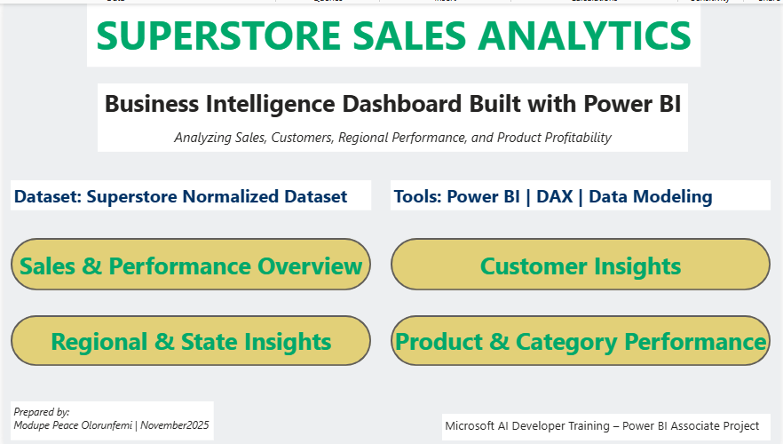
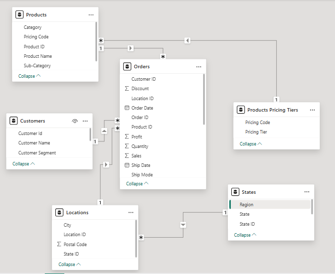
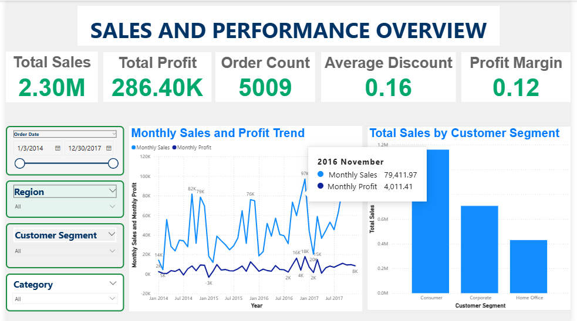
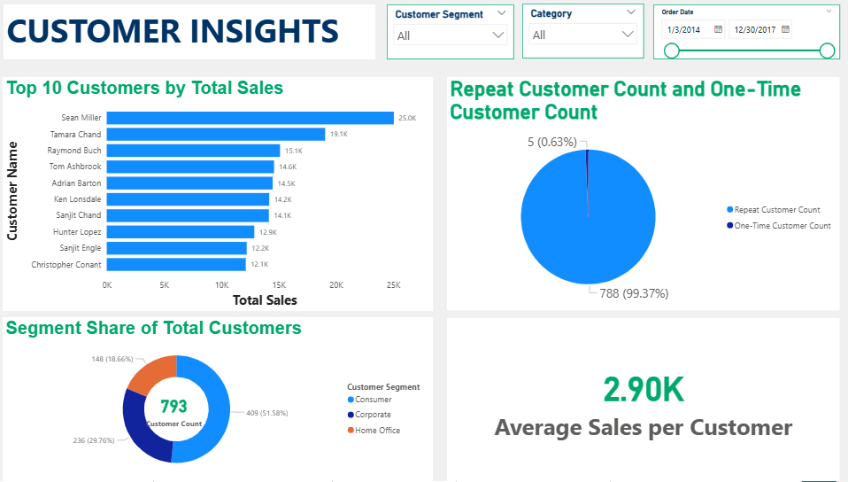
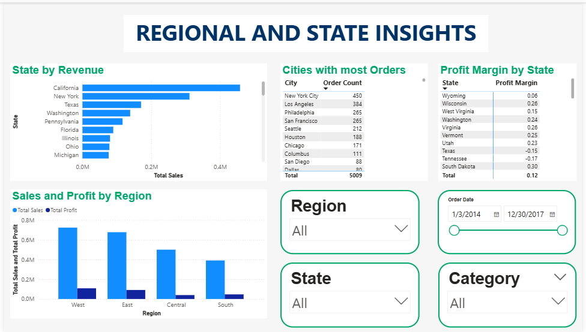
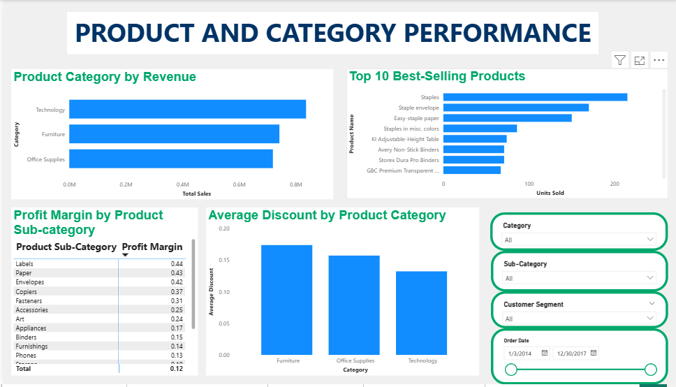

# Superstore Sales Analytics

## Project Overview
This project presents an interactive business intelligence dashboard built using Microsoft Power BI Desktop to analyze retail sales performance using the Superstore Normalized Dataset.
The objective of this project is to transform raw retail transaction data into meaningful insights that support data-driven decision making. The dashboard analyzes key business metrics including revenue, profitability, customer behavior, regional sales distribution, and product performance.
Through data modeling, DAX calculations, and interactive visualizations, the report provides stakeholders with a comprehensive view of business performance across multiple business dimensions.

## Business Problem

Retail organizations generate large volumes of transactional data across customers, products, and geographic regions. However, without proper analysis tools, it becomes difficult to extract meaningful insights that inform business strategy.

This project addresses several key business questions:

- What is the overall sales and profit performance of the company?
- Which customer segments contribute the most revenue?
- Which regions and states generate the highest profitability?
- Which product categories drive the most sales?
- How do discounts affect profit margins?

The goal of this project is to build an interactive business intelligence dashboard that enables stakeholders to explore these questions through visual analytics.

## Dataset Description
The Superstore dataset represents a fictional retail company and is structured using multiple related tables designed to simulate real-world business data.
1. **Orders**: Contains detailed transactional records including: Order ID, Order Date, Ship Date, Ship Mode, Customer ID, Location ID, Product ID, Quantity, Sales, Discount, Profit.
2. **Customers**:
- Contains customer information including: Customer ID, Customer Name, Customer Segment.
- Customer segments include: Consumer, Corporate, Home Office.
3. **Locations**: Contains geographic information including: Location ID, City, State ID, Postal Code.
4. **States**: Contains State ID, States, Region. It maps states to regional classifications: East, West, Central, South.
5. **Products**: Contains Product ID, Product Name, Category, Sub-Category, Pricing Code.
6. **Product Pricing Tiers**: Contains pricing tier information connected to products using Pricing Code.

## Data Modeling
The dataset is structured using a normalized relational data model designed to support efficient and scalable multidimensional analysis.

The Orders table serves as the central fact table, capturing transactional metrics such as sales, profit, quantity, and discount. This table is connected to multiple dimension tables that provide descriptive context for customers, products, and geographic locations.
#### Key Relationships
The following relationships were established within the data model:
- Orders --- Customers (Customer ID)
- Orders --- Products (Product ID)
- Orders --- Locations (Location ID)
- Locations --- States (State ID)
- Products --- Product Pricing Tiers (Pricing Code)

This relational structure enables flexible analysis across key business dimensions, including:
- Customer segments and behavior  
- Product categories and performance  
- Regional and state-level performance  
- Sales and profitability metrics

#### Data Model View
Below is the data model diagram created in Microsoft Power BI Desktop, showing the relationships between the fact and dimension tables.

## Key Measures (DAX)
Several key performance indicators were calculated using DAX.
1. **Total Sales** = SUM(Orders[Sales])
2. **Total Profit** = SUM(Orders[Profit])
3. **Order Count** = DISTINCTCOUNT(Orders[Order ID])
4. **Average Discount** = AVERAGE(Orders[Discount])
5. **Customer Count** = DISTINCTCOUNT(Customers[Customer ID])
6. **Profit Margin** = DIVIDE([Total Profit], [Total Sales])

## Dashboard Pages
The Power BI report contains four analytical dashboards.
1. **Sales & Performance Overview**: Provides a high-level overview of overall company performance including total sales, total profit, order volume, profit margin, and sales trends over time.
2. **Customer Insights**: Analyzes customer behavior and segmentation, including top customers by revenue, customer distribution across segments, and repeat versus one-time customers.
3. **Regional & State Insights**: Examines geographic performance across regions and states, highlighting revenue distribution, profit margins, and cities with the highest order volumes.
4. **Product & Category Performance**: Evaluates product-level performance including revenue by product category, best-selling products, profit margins by product sub-category, and discount patterns across product category.

## Dashboard Preview
Below are previews of the dashboards included in the report.

## Accessing the Interactive Dashboard
Due to Power BI sharing limitations for personal accounts, the interactive dashboard is provided as a downloadable Power BI file.
Users can download the report and open it using Microsoft Power BI Desktop to interact with the dashboards and explore the analysis.
Download the report files below:

#### Power BI Report File (.pbix)
dashboards/superstore_dashboard.pbix

#### PDF Version of the Report
reports/superstore_dashboard.pdf

## Key Insights
Several strategic insights were derived from the analysis of sales, customer behavior, regional performance, and product trends:
1. **Revenue is Strong, but Profitability is Relatively Low**: The business generated $2.30M in total sales, but only $286.40K in profit, resulting in a profit margin of 12%. This indicates that while revenue generation is strong, profitability is relatively constrained, suggesting potential inefficiencies in pricing, discounting, or cost structure.
2. **Consumer Segment Dominates Customer Base and Revenue Contribution**: The Consumer segment accounts for over 51.58% of total customers, making it the largest customer group. Additionally, the Consumer segment also generates the highest total sales, indicating that business performance is heavily driven by individual consumers rather than corporate clients.
3. **Extremely High Customer Retention Rate**: The dataset shows that 99.37% of customers are repeat customers, with only 0.63% being one-time buyers. This suggests strong customer retention and loyalty, which is a major strength of the business and a key driver of sustained revenue.
4. **Revenue is Geographically Concentrated in Key States and Cities**: States such as California and New York generate the highest sales, while cities like New York City and Los Angeles have the highest order volumes. This indicates that revenue is highly concentrated in a few major markets, creating both growth opportunities and geographic dependency risks.
5. **Technology Category is the Primary Revenue Driver**: The Technology category generates the highest total sales, outperforming Furniture and Office Supplies. This makes Technology the core revenue engine of the business.
6. **High Discounts Are Likely Reducing Profitability**: The average discount is 16%, with certain categories (especially Furniture) receiving higher discounts. At the same time, overall profit margin remains relatively low, indicating a negative relationship between discounting and profitability.
7. **Significant Variation in Profitability Across Product Sub-Categories**: Some sub-categories such as Labels, Paper, and Envelopes achieve very high profit margins (above 40%), while others perform significantly lower. This suggests uneven product profitability, highlighting opportunities for optimization.

## Business Recommendations
Based on the insights derived from the analysis, the following strategic actions are recommended:
1. **Optimize Discount Strategy to Improve Profitability**: The average discount rate is relatively high, while overall profit margin remains low.
- Reduce excessive discounting, especially in low-margin categories.
- Implement controlled or tiered discount strategies.
- Use data-driven approaches to balance sales growth and profitability.
2. **Invest in High-Performing Product Categories**: The Technology category is the primary revenue driver.
- Increase focus on high-performing categories such as Technology
- Expand inventory and promotional efforts for top-selling products
- Prioritize high-margin sub-categories (e.g., Labels, Paper)
3. **Leverage Strong Customer Retention**: With a very high repeat customer rate (~99%), the business has a strong loyalty base.
- Introduce customer loyalty or reward programs
- Use personalized marketing to increase customer lifetime value
- Upsell and cross-sell to existing customers
4. **Expand in High-Revenue Geographic Markets**: Sales are concentrated in key states and cities.
- Increase marketing and operations in top-performing locations (e.g., California, New York)
- Use high-performing regions as benchmarks for growth in other areas
5. **Optimize Product Portfolio for Profitability**: There is significant variation in profit margins across product sub-categories.
- Focus on high-margin products
- Reassess pricing strategies for low-margin items
- Reduce reliance on underperforming products

